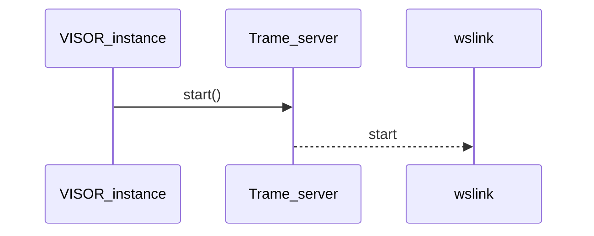

# ADR 03: VISOR Python API

## Status
Decided

## Context
The VISOR visualization component can be integrated into a Python application in the context of the pyAnsys initiative. A pythonic interface helps with interoperability with initiatives and interfaces like the pyansys-visualization-tools interface.

## Decision
Provide a Python API which aids integration with Python projects from the PyAnsys initiative and leads to easier Python programming in Jupyter notebooks and Ansys labs as well as eases integration with ansys-visualization-interface from the PyAnsys initiative. This Python API is only meant to be used in a Python application environment and not as a way to integrate with SAF.

### VISOR instance

The VISOR instance is able to select the rendering engine, the url where the visualization will be starting for the native browser to be able to handle the visualization as well as the ability to have a standalone visualization or use this Python API for integrating with a local desktop Dash application. Each instance of VISOR is only going to work on a single url and session.

VISOR is a server-client architecture and currently it only support a single backend which is using VTK.WASM utilizing the Trame framework. VISOR service is starting a [Trame](https://trame.readthedocs.io/en/latest/) [server](https://trame.readthedocs.io/en/latest/viewer.server.html) on the backend. The Trame server is calling [wslink](https://github.com/Kitware/wslink) to setup a websocket connection to from the host to the client. The only way to provide input is through the service side API and not through the client API.

The VISOR instance marks the lifecycle of VISOR within this Python execution environment. There is no way to connect to this instance from a different Python environment, apart from the url which is executing the client. The client side is updating the input of VISOR as VISOR is a service that is always managed by the server side. When the VISOR instance is destroyed due to the Python process ending or getting out of scope all of the services and temporary files and folders need to be cleaned up.

```text
visor_default_instance = Visor(
    url: str | None = None,
    input: str| vtkDataSet | None = None,
    metadata: Metadata | None = None,
    standalone: bool = True,
)

```

The VISOR instance makes it possible to change the default configuration for url, logs, input_file_paths and all relevant settings through a Settings object constructed based on the
ansys.visor.viewer config.py file.
The Settings object is defined as follows:

```text
class Settings(BaseSettings):
    app_name: str = "VISOR Viewer"
    default_host: str = "localhost"
    default_port: int = 8081
    default_standalone: bool = True
    default_client_bundle: str = Path("client_bundle")
    default_log_dir: str = str(Path.cwd().joinpath("logs"))
    trame_log_dir: str | None = None

```
The app_name is able to rename the application name of the component for the current execution.
The default_host and default_port make it possible to provide a different host and port of execution.
The default_standalone is whether the VISOR server is going to be hosting the webclient.
The default_client_bundle is where the client bundle has been deployed for the static client code
The default_log_dir provides the path to logs
The default_trame_log_dir provides the path to trame logging.


#### Start

```text
def start(self, input: vtkDataSet| str | None, timeout = 0) -> int
```

Starts the Trame server [start](https://trame.readthedocs.io/en/latest/viewer.server.html#trame_server.viewer.Server.start). All the relevant configurations have been provided at the time of instantiation from VISOR. There is the option to provide an input on the start function where it can be an in-memory vtk object in terms of a vktDataSet or a path to a file which at this point can only be a VTK formatted file. Due to VISOR accepting only its internal native format VISOR doesn't do any internal conversions.

The visualization starts on a background thread instead of the current process to allow for the update() and stop() APIs to be used without any multi-threading management to happen on the user's side.



The relevant API is the following:
```text
// Start visualization application in the same thread.
// When the browser is closed.
def start(
    self,
    input: str | vtkDataSet | None,
    metadata: Metadata | None = None,
    timeout: int = 0,
) -> int
```

 *Example usage*
```text
    visualizer = Visor()
    output = converter.to_data_set()
    visualizer.start()
    #...Thread continues execution while VISOR is visualizing the input
```

#### Update
The update function updates the input of the current visualization already running in the same Python process.
This clears any existing datasets from the scene, and adds the new dataset (and optionally metadata) to the scene.

```text
def update(self, input: str|vtkDataSet, metadata: Metadata | None = None) -> int
```

Example:
```text
visualizer = Visor()
    output = converter.to_vtk_file(a_processed_file,a_processed_file_vtk)
    visualizer.start(input = a_processed_file_vtk)
    another_output = converter.to_vtk_dataset(a_processed_result, vtk_dataset)
    visualizer.update(vtk_dataset)
    ### more code executed here
```

#### Add dataset
The `add_dataset` function adds a new dataset as input to current visualization already running in the same Python process.
This keeps any existing datasets in the scene, and adds the new dataset (and optionally metadata) to the scene.

```text
def add_dataset(self, input: str|vtkDataSet, metadata: Metadata | None = None) -> int
```

Example:
```text
visualizer = Visor()
    output = converter.to_vtk_file(a_processed_file,a_processed_file_vtk)
    dataset_id1 = visualizer.start(input = a_processed_file_vtk)
    another_output = converter.to_vtk_dataset(a_processed_result, vtk_dataset)
    dataset_id2 = visualizer.add_dataset(vtk_dataset)
    ### more code executed here
```

#### List datasetss
The `list_datasets` function lists all datasets currently in the scene of the current visualization already running in
the same Python process.  The scene is not modified with this operation.

```text
def list_datasets(self) -> list[int]
```

Example:
```text
visualizer = Visor()
    output = converter.to_vtk_file(a_processed_file,a_processed_file_vtk)
    visualizer.start(input = a_processed_file_vtk)
    another_output = converter.to_vtk_dataset(a_processed_result, vtk_dataset)
    visualizer.add_dataset(vtk_dataset)
    visualizer.list_datasets()
    ### more code executed here
```


#### Remove dataset
The `remove_dataset` function removes a dataset from the current visualization already running in the same Python process.


```text
def remove_dataset(self, dataset_id: int)
```

Example:
```text
visualizer = Visor()
    output = converter.to_vtk_file(a_processed_file,a_processed_file_vtk)
    dataset_id1 = visualizer.start(input = a_processed_file_vtk)
    another_output = converter.to_vtk_dataset(a_processed_result, vtk_dataset)
    dataset_id2 = visualizer.add_dataset(vtk_dataset)
    visualizer.remove_dataset(dataset_id2)

    ### more code executed here
```

#### List variables
The `list_variables` function lists all variables for a given dataset in the scene of the current visualization already running in
the same Python process.  The scene is not modified with this operation.

```text
def list_variables(self, dataset_id: int) -> list[VisorVariable]
```

Example:
```text
visualizer = Visor()
    output = converter.to_vtk_file(a_processed_file,a_processed_file_vtk)
    dataset_id1 = visualizer.start(input = a_processed_file_vtk)
    dataset_id1_variables = visualizer.list_variables(dataset_id1)
    ### more code executed here
```

#### Update variables
The `update_variables` function updates the variables for a given dataset in the scene of the current visualization already running in
the same Python process.

**Limitation:** This feature is currently only supported for VTK datasets that are either vtkPolyData or vtkUnstructuredGrid.
VISOR also supports vtkMultiBlockDataSet and vtkMultiPieceDataset, and we plan to support for variable updates
on parts within these composite datasets in a future release, but
as of 2026/02/03, that is not yet supported.


```text
def update_variables(
    self,
    dataset_id: int,
    variables: list[dict[str, Any]],
) -> None
```

Example:
```text
visualizer = Visor()
    output = converter.to_vtk_file(a_processed_file,a_processed_file_vtk)
    dataset_id1 = visualizer.start(input = a_processed_file_vtk)
    dataset1_variables = visualizer.list_variables(dataset_id1)
    # Example assumes updating the first variable in the list
    variable_to_update = dataset1_variables[0]
    # Get number of points and components if needed
    num_points = variable_to_update.num_points
    num_components = variable_to_update.num_components
    name = variable_to_update.name
    # Generate new variable data as a list or numpy array
    new_vector_values = np.zeros((num_points, num_components))
    # Create dictionary for variable update
    variable_update_info = {
        "type": "point",
        "name": name,
        "num_components": num_components,
        "data": new_vector_values
    }
    # Update the variable in VISOR
    visualizer.update_variables(dataset_id1, [variable_update_info])
    ### more code executed here
```


#### Stop
This API stops the rendering from the Trame service, it doesn't terminate the server or the connection. If the stop method isn't called, the visualization is stopped by an interrupt when the connections and servers are killed when the lifecycle of the VISOR instance ends.

```text
 def stop()
```


Example:
```text
visualizer = Visor()
    output = converter.to_vtk_file(a_processed_file,a_processed_file_vtk)
    visualizer.start(input = a_processed_file_vtk)
    another_output = converter.to_vtk_dataset(a_processed_result, vtk_dataset)
    visualizer.update(vtk_dataset)
    visualizer.stop()
    ### more code executed here
```

#### Save state

This is a function that saves the current state of the VISOR service to a file given the filepath.

```text
async def save_state(self, state_directory_path)
```

#### Load state

This is a function that loads the current state to the VISOR viewer.

```text
def load_state(self, state_file)
```


## References

* trame services used are documented [here](https://trame.readthedocs.io/en/latest/viewer.server.html#).
* [wslink](https://github.com/Kitware/wslink)
* The branch that contains the above code in a PoC form is [demo](https://github.com/ansys-internal/theia/tree/demo)


### Notes from discussion on 14th Nov. '24

* Rendering engine can be changed and it should be in the initialization of the service
* Add connect_to(server) api
* Initialize using an existing server
* Save state API

### Notes from discussion on 21st Nov '24
* The load/save state in terms of locking when multiple users/multiple sessions are involved
* Options for RenderingEngine versus configuration like VTK / WASM / Local Rendering / Remote Rendering


### Notes
The API for Python applications needs to be able to start VISOR on a background thread without the user needing to manage asynchronous code from their side. The destruction of reference of the VISOR instance can signal the destruction of the VISOR instance using the atexit python library.