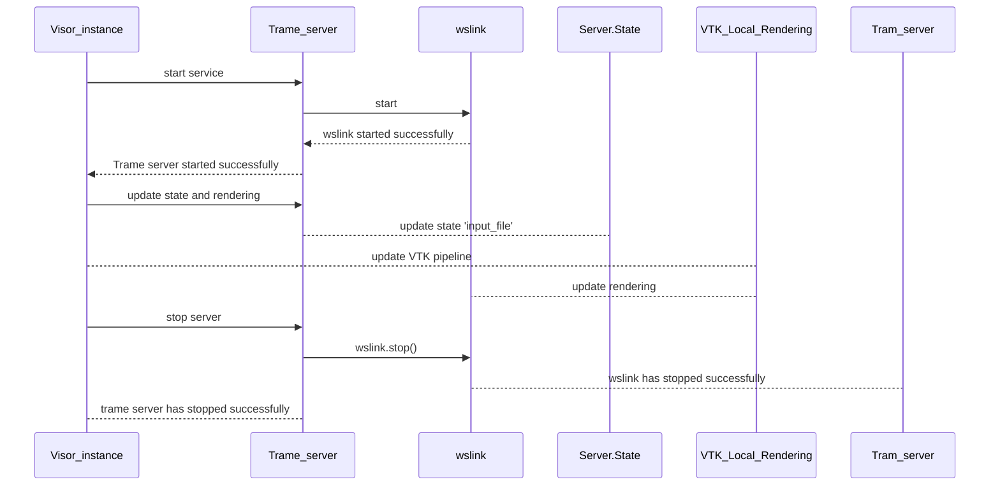

# ADR 10: VISOR RESTful Service

## Status
Decided

## Context
VISOR is the visualization component for Solutions Applications Framework. VISOR is used a service through the PIM configuration management from SAF. This service is managed by SAF Product Instance Manager (PIM) in terms of its lifecycle and in that way its configuration allows it to be used by SAF engineers through the REST interface it provides.

## VISOR Service

The VISOR service currently only supports an infrastructure based on Trame client-side rendering through VTK.WASM technology. This Trame framework efficiently only supports only one session and the authentication and authorization for the session is handled outside of VISOR. The client-server connection is based on ws-link which creates a WebSocket connection from the server to the client browser of the user. Management of files for VISOR currently only support loading in memory from a local storage unit in order to create an internal representation in memory based on a scene-graph. The VTK pipeline is setup on the server and the final stage is transferred to the client where it will locally manage user interaction on an optimistic mechanism that most of the processes can be serialized through its architecture and locally caching and computation will only be transferred to the server in terms of state management through the internal VISOR mechanism.

VISOR service can save its state and load from its previous state. The way the current VISOR service is managed is shown from the following sequence diagram.


#### Sequence Diagram





### REST API

 VISOR's REST API is following the OpenAPI specification and is versioned with the same version as VISOR (it doesn't have an independent versioning scheme) from the rest of VISOR and the VISOR Python API.

### GET /
The get root endpoint returns the url where the visualization is going to be hosted.
```json
{"/":{
    "get":{
        "summary":"Get Url",
        "description":"Get the URL of visualizer. It initializes visualizer if it is not initialized",
        "operationId":"get_url__get",
        "responses":{
            "200":{"description":"Successful Response",
            "content":{
                "application/json":{"schema":{}}
                }
            }
        }
    }
    },
```


#### GET /info
Get the information of the visualizer instance. It provides the information set by the config.py file which contains the basic settings for creating a VISOR instance.
The Settings object is defined as follows:

```python
class Settings(BaseSettings):
    app_name: str = "VISOR Viewer"
    default_host: str = "localhost"
    default_port: int = 8081
    default_standalone: bool = True
    default_client_bundle: str = Path("client_bundle")
    default_log_dir: str = str(Path.cwd().joinpath("logs"))
    trame_log_dir: str | None = None
```
The app_name is able to rename the application name of the component for the current execution.
The default_host and default_port make it possible to provide a different host and port of execution.
The default_standalone is whether the VISOR server is going to be hosting the webclient.
The default_client_bundle is where the client bundle has been deployed for the static client code
The default_log_dir provides the path to logs
The default_trame_log_dir provides the path to trame logging.


When the VISOR service is started by an external program like uvicorn the service is using these Settings in order to launch VISOR on a specific host, port and use those logs.


```json
{
  "app_name": "VISOR Viewer",
  "host": "localhost",
  "port": 8081,
  "standalone": true,
  "file_input_path": null
}
```

### POST initialize/

This endpoint provides the chance to initialize the defaults for the Trame service this VISOR service will be controlling.

```Python
class InitProps(BaseModel):
    """Properties for initializing the server."""
    host: str = Field(..., description="Host address", example="localhost")
    port: int = Field(..., description="Port number", example=8081)
```

```json
"/initialize":{"post":{"summary":"Initialize Server","description":"Initialize the server with the given port, host and client distribution path","operationId":"initialize_server_initialize_post","requestBody":{"content":{"application/json":{"schema":{"$ref":"#/components/schemas/InitProps"}}},"required":true},"responses":{"200":{"description":"Successful Response","content":{"application/json":{"schema":{}}}},"422":{"description":"Validation Error","content":{"application/json":{"schema":{"$ref":"#/components/schemas/HTTPValidationError"}}}}}}}
```


### POST start/

This endpoint starts the visualization for the service on the provided url for a single session.
It can provide an input file on start as an option.
Only files are supported on this API since this is a RESTful service based on HTTP API.

```json
"/start":{
    "post":{
        "summary":"Start Instance",
        "description":"Start visualizer instance",
        "operationId":"start_instance_start_post",
        "requestBody":{
            "content":{
                "application/json":{
                    "schema":{
                        "$ref":"#/components/schemas/StartProps"}
                        }
                        },
                        "required":true},
                        "responses":{
                            "200":{
                                "description":"Successful Response",
                                "content":{"application/json":{"schema":{}}}},
                                "422":{
                                    "description":"Validation Error",
                                    "content":{
                                        "application/json":{
                                            "schema":{"$ref":"#/components/schemas/HTTPValidationError"}}}}}}},

```

The parameter model for the start endpoint are the following:

```Python
class StartProps(BaseModel):
    """Properties for starting the visualizer instance."""
    file_path: Optional[str] = Field(None, description="Path to the input file", example="path/to/file.vtk")
    metadata: Optional[Metadata] = Field(None, description="Metadata for the visualizer", example={"name": "test_model", "unit": "m"})
    timeout: Optional[int] = Field(0, description="Timeout in seconds")
```

### POST /update

This endpoint updates the input file to the service. Only files are supported to this endpoint as there is currently no efficient serialization mechanism through this RESTful service for any other data formats.

```json
"/update":{
    "post":{
        "summary":"Update",
        "description":"Update the input file of visualizer instance",
        "operationId":"update_update_post",
        "requestBody":{
            "content":{
                "application/json":{
                    "schema":{
                        "$ref":"#/components/schemas/UpdateProps"}}},
                        "required":true},
                        "responses":{
                            "200":{"description":"Successful Response","content":{"application/json":{"schema":{}}}},
                            "422":{
                                "description":"Validation Error",
                                "content":{"application/json":{"schema":{"$ref":"#/components/schemas/HTTPValidationError"}}}}}}},
```

The parameter model for the update endpoint are the following:
```Python
class UpdateProps(BaseModel):
    """Input for updating the visualizer instance."""
    file_path: str = Field(..., description="Path to the new input file", example="path/to/updated_file.vtk")
    metadata: Optional[Metadata] = Field(None, description="Metadata for the visualizer", example={"name": "updated_model", "unit": "m"})
```

### POST /add_dataset

This endpoint adds a new input file to the service. Only files are supported to this endpoint as there is currently no
efficient serialization mechanism through this RESTful service for any other data formats.

```json
"/add_dataset": {
  "post": {
    "summary": "Add Dataset",
    "operationId": "add_dataset_add_dataset_post",
    "requestBody": {
      "content": {
        "application/json": {
          "schema": {
            "$ref": "#/components/schemas/UpdateProps"
          },
          "example": {
            "file_path": "path/to/updated_file.vtk",
            "metadata": {
              "name": "updated_model",
              "unit": "m"
            }
          }
        }
      },
      "required": true
    },
    "responses": {
      "200": {
        "description": "Successful Response",
        "content": {
          "application/json": {
            "schema": {}
          }
        }
      },
      "422": {
        "description": "Validation Error",
        "content": {
          "application/json": {
            "schema": {
              "$ref": "#/components/schemas/HTTPValidationError"
            }
          }
        }
      }
    }
  }
},
```


The parameter model for the add_dataset endpoint are the following (same as the update endpoint):
```Python
class UpdateProps(BaseModel):
    """Input for updating the visualizer instance."""
    file_path: str = Field(..., description="Path to the new input file", example="path/to/updated_file.vtk")
    metadata: Optional[Metadata] = Field(None, description="Metadata for the visualizer", example={"name": "updated_model", "unit": "m"})
```

### GET /list_datasets
This endpoint lists all datasets currently loaded in the visualizer instance.
```json
"/list_datasets": {
  "get": {
    "summary": "List Datasets",
    "operationId": "list_datasets_list_datasets_get",
    "responses": {
      "200": {
        "description": "Successful Response",
        "content": {
          "application/json": {
            "schema": {}
          }
        }
      }
    }
  }
},
```

### POST /remove_dataset
This endpoint removes a dataset from the visualizer instance.  A dataset ID is required to identify which dataset to remove.

```json
"/remove_dataset": {
  "post": {
    "summary": "Remove Dataset",
    "operationId": "remove_dataset_remove_dataset_post",
    "requestBody": {
      "content": {
        "application/json": {
          "schema": {
            "$ref": "#/components/schemas/RemoveDatasetProps"
          },
          "example": {
            "dataset_id": 123456
          }
        }
      },
      "required": true
    },
    "responses": {
      "200": {
        "description": "Successful Response",
        "content": {
          "application/json": {
            "schema": {}
          }
        }
      },
      "422": {
        "description": "Validation Error",
        "content": {
          "application/json": {
            "schema": {
              "$ref": "#/components/schemas/HTTPValidationError"
            }
          }
        }
      }
    }
  }
},
```

The parameter model for the remove_dataset endpoint are the following:
```Python
class RemoveDatasetProps(BaseModel):
    """Input for removing a dataset from the visualizer instance."""
    dataset_id: int = Field(..., description="ID of the dataset to remove", example=12345)
```

### GET /{dataset_id}/list_variables
This endpoint lists variables for a specific dataset in the visualizer instance.

```json
    "/{dataset_id}/list_variables": {
  "get": {
    "summary": "List Variables",
    "operationId": "list_variables__dataset_id__list_variables_get",
    "parameters": [
      {
        "name": "dataset_id",
        "in": "path",
        "required": true,
        "schema": {
          "type": "integer",
          "title": "Dataset Id"
        }
      }
    ],
    "responses": {
      "200": {
        "description": "Successful Response",
        "content": {
          "application/json": {
            "schema": {}
          }
        }
      },
      "422": {
        "description": "Validation Error",
        "content": {
          "application/json": {
            "schema": {
              "$ref": "#/components/schemas/HTTPValidationError"
            }
          }
        }
      }
    }
  }
},
```

### POST /{dataset_id}/update_variables
This endpoint updates variables for a specific dataset in the visualizer instance.

**Limitation:** This feature is currently only supported for VTK datasets that are either vtkPolyData or vtkUnstructuredGrid.
VISOR also supports vtkMultiBlockDataSet and vtkMultiPieceDataset, and we plan to support for variable updates
on parts within these composite datasets in a future release, but
as of 2026/02/03, that is not yet supported.

```json
"/{dataset_id}/update_variables": {
  "post": {
    "summary": "Update Variables",
    "operationId": "update_variables__dataset_id__update_variables_post",
    "parameters": [
      {
        "name": "dataset_id",
        "in": "path",
        "required": true,
        "schema": {
          "type": "integer",
          "title": "Dataset Id"
        }
      }
    ],
    "requestBody": {
      "required": true,
      "content": {
        "application/json": {
          "schema": {
            "$ref": "#/components/schemas/UpdateVariableProps"
          }
        }
      }
    },
    "responses": {
      "200": {
        "description": "Successful Response",
        "content": {
          "application/json": {
            "schema": {}
          }
        }
      },
      "422": {
        "description": "Validation Error",
        "content": {
          "application/json": {
            "schema": {
              "$ref": "#/components/schemas/HTTPValidationError"
            }
          }
        }
      }
    }
  }
},
```

The parameter model for the update_variables endpoint are the following:
```Python
class UpdateVariableInfo(BaseModel):
    """Input for updating a variable in the visualizer instance."""
    name: str = Field(..., description="Name of the variable to update", example="temperature")
    type: str = Field(..., description="Type of the variable (point/cell)", example="point")
    num_components: int = Field(..., description="Number of components", example=1)
    data: list[float] = Field(..., description="Data array for the variable", example=[0.0, 1.0, 2.0, 3.0])

class UpdateVariableProps(BaseModel):
    """Input for updating a variable in the visualizer instance."""
    variables: list[UpdateVariableInfo] = Field(..., description="List of variables to update")
```

### POST /stop_visualization

This endpoint stops the visualization but not the running service. The Trame server is stopped and the websocket connection is killed but the service is still running.

```json
"/stop_visualization":{
    "post":{
        "summary":"Stop Instance Visualization",
        "description":"Stop instance visualization",
        "operationId":"stop_instance_stop_visualization_post",
        "responses":{"200":{"description":"Successful Response","content":{"application/json":{"schema":{}}}}}}}
```

### POST /stop

This endpoint stops the visualization and deletes the visualizer instance. The Trame server is stopped, the websocket connection is killed, and the visualizer instance is cleaned up.

```json
"/stop":{
    "post":{
        "summary":"Stop Instance",
        "description":"Stop visualizer instance",
        "operationId":"stop_instance_stop_post",
        "responses":{"200":{"description":"Successful Response","content":{"application/json":{"schema":{}}}}}}}
```

### GET /health

This endpoint provides a basic health check for the RESTful service.

```json
"/health":{
    "get":{
        "summary":"Health",
        "description":"Get the health status of the RESTful service",
        "operationId":"health_health_get",
        "responses":{"200":{"description":"Successful Response","content":{"application/json":{"schema":{}}}}}
```


### Implementation

The Python API used for implementing this service is private to the VISOR service and it can be used to create wrappers or other services but it is only useful for this use case.