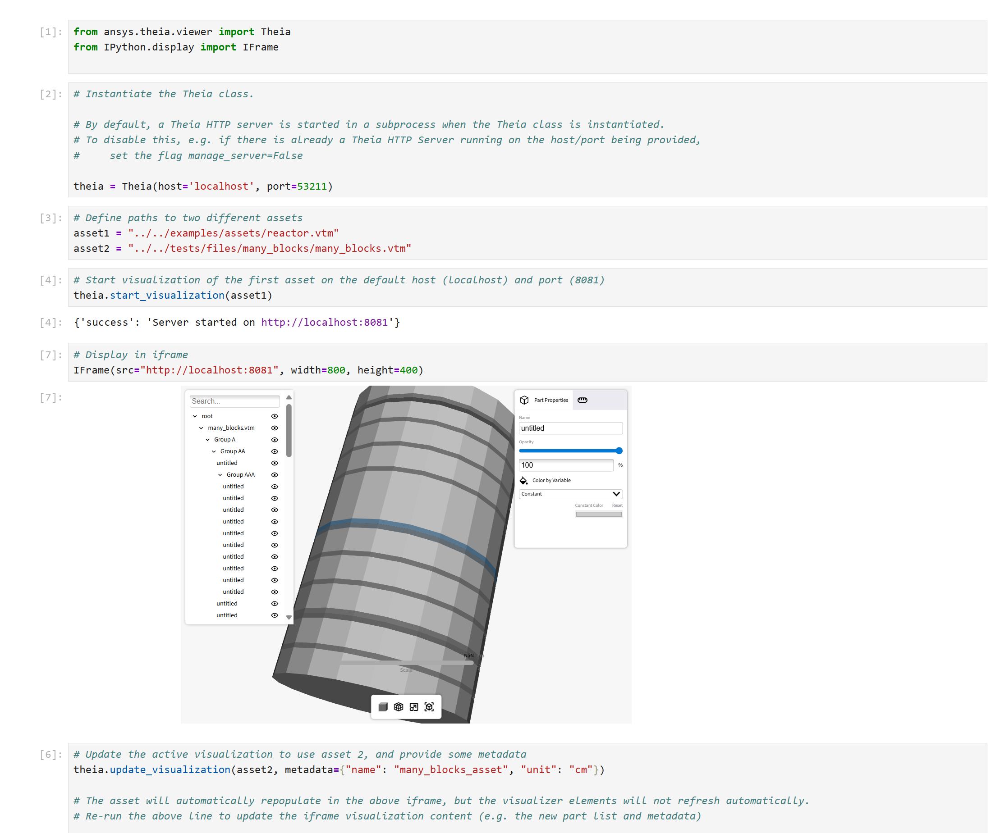
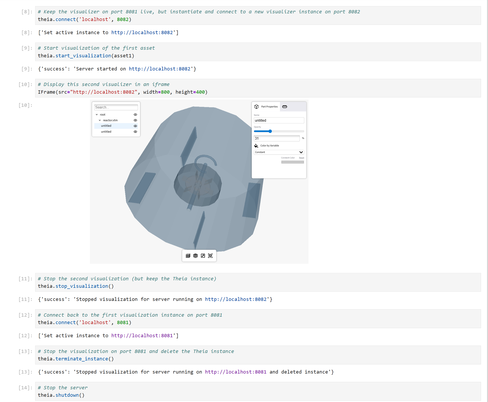

# ADR 11: Introduce Python Client and Service Management for VISOR API

## Status
Proposed

This ADR was discussed but not adopted as of Aug 28, 2025.


## Base Context
Previously, Python users interacted directly with the `Visor` class, using its start, update, and stop methods to
manage visualizations. However, this approach poses challenges in interactive environments like Jupyter notebooks.

Additionally, we have a command-line interface (CLI) tool, `visor-cli`, which allows users to manage VISOR instances
and visualizations via terminal commands. This CLI interacts with the VISOR HTTP service endpoints, providing
a consistent experience across different interfaces.

To improve compatibility and usability, we propose updating the Python entrypoint.  We introduce a new
`Visor` class that interacts with the VISOR HTTP service instead of instantiating Python-native visualization
object.  This new class relies on a lightweight client that wraps HTTP API calls to the
service endpoints and simple service layer that optionally manages the server process.

The new entrypoint enables reliable and Python-native interaction in notebooks and other interactive environments.
However, it does not support in-memory data inputs, as all interactions occur through the HTTP API.
In this ADR, we outline the proposed changes, their rationale, pros and cons of this approach, and example usage.


## Problem Statement
We expect SAF users to interact with the VISOR using SAF's
[Product Instance Manager](https://saf.glow.docs.solutions.ansys.com/version/stable/user_guide/using_ansys_products/product_instance_management/custom_instance_managers.html)
(PIM) framework.
However, we also want to enable PyAnsys users outside of SAF to interact with VISOR endpoints
in a pythonic way, without requiring the full PIM stack.

Until now, the VISOR class has served as the main entrypoint for Python users, allowing control
of the Trame server visualization.  However, there are some potential limitations of this approach.
1. **Instability in interactive environments**:
Running a Trame server in a background thread within a native Python instance can lead to instability due
to differences in how various environments like scripts, Jupyter notebooks, and interactive shells manage event loops,
I/O, and concurrency.  For more reliable and consistent behaviour across contexts, it's often preferable to
isolate the server lifecycle in a dedicated service or process.
2. **Fragmented entrypoints:**
This model introduces two separate entrypoints for VISOR usage: the VISOR HTTP service (via PIM) for SAF users, and
native Python instances for PyAnsys users.  While maintaining both paths may offer short-term flexibility for
beta testing and feedback, it may increase long-term development and maintenance overhead.

## Proposed Solution
To address these limitations, and to allow non-SAF users the ability to interact with the VISOR endpoints
pythonically, we are introducing a new Python `Visor` class that interacts with the HTTP service through
a simple client and service management layer.

By allowing users to start and stop the VISOR HTTP service from Python in a subprocess, this approach
avoids event loop conflicts in Jupyter notebooks. Running the service in a separate process from the main
notebook allows it to freely perform asynchronous
operations - such as launching, starting, stopping, or updating Trame servers - without interfering
with the notebook’s event loop.

The `Visor` class manages the HTTP service lifecycle through `uvicorn` in a subprocess,
and it provides programmatic access to the VISOR API endpoints.  The user can optionally disable the service
management if they want to run the service themselves or connect to an existing service.

With these changes, both SAF and non-SAF Python users can interact with VISOR endpoints
without relying on the full PIM stack. The HTTP service can also be run independently,
supporting access from any HTTP client, including Python scripts and web browsers.


The proposed changes are as follows:

1. **New class (User-Facing):** `Visor`
   - New main entrypoint for Python users, importable from `ansys.visor.viewer`
   - Wrapper around the FastAPI layer (VisorAPI) that would enable a user to interact with the VISOR API
   - Automatically runs the VISOR HTTP service via `uvicorn` subprocess, for users who should not need to worry about
starting/stopping the service.
   - Includes a `manage_server` parameter to optionally disable automatic server management.
2. Rename old `Visor` class → `VisorVisualizer`
   - Was previously exposed under `ansys.visor.viewer` -> remove this exposure
   - Rename old `VisorTrameInterface` class → `VisorTrameVisualizer` accordingly
(it implements the old `Visor` class).
4. Update `visor-cli` commands to align with the above changes
5. Add a Jupyter notebook to show a concrete example of usage in Python


### Summary Table

See the following table to better summarize how the VISOR HTTP service functionality maps between the HTTP endpoints, Python API, and VISOR CLI.

| Function                                   | VISOR HTTP Service         | Python API                        | VISOR CLI                      |
|---------------------------------------------|----------------------------|------------------------------------|---------------------------------|
| **Server Operations**                       |                            |                                    |                                 |
| Start server                               | `uvicorn ...`              | `server.start()`                   | `visor-cli server start`        |
| Stop server                                | `ctrl+c`                   | `server.stop()`                    | `ctrl+c`                        |
| Server health                              | `/health`                  | `client.health()`                  | `visor-cli server health`       |
| **Instance Management & Visualization**     |                            |                                    |                                 |
| Connect to (or initialize new) instance    | `/initialize`              | `client.connect(host='localhost', port=8082)` | `visor-cli instance connect --port 8082` |
| Info about active instance                 | `/info`                    | `client.info()`                    | `visor-cli instance info`       |
| Start visualization                        | `/start`                   | `client.start_visualization(my_file1)` | `visor-cli instance start path/to/my/file1.vtm` |
| Update visualization                       | `/update`                  | `client.update_visualization(my_file2)` | `visor-cli instance update path/to/my/file2.vtm` |
| Stop visualization                         | `/stop_visualization`      | `client.stop_visualization()`      | `visor-cli instance stop`       |
| Terminate instance                         | `/stop`                    | `client.terminate_instance()`      | `visor-cli instance terminate`  |


## Pros and Cons: Old vs New Entrypoints

### Old Entrypoint (old `Visor` class -> renamed to `VisorVisualizer`)
**Pros:**
1. Supports in-memory data inputs: Enables workflows that do not require writing files to disk.
2. Simplicity: No need to manage subprocesses or external services.
3. Direct, low-level control: Advanced users can customize and extend behavior more easily.

**Cons:**
1. Not robust in interactive environments: Event loop conflicts in Jupyter notebooks and similar environments.
2. No parity with CLI or HTTP API: Functionality and experience differ from other interfaces.
3. Limited scalability: Tightly coupled to the Python process, making containerization and
orchestration harder.

### New Entrypoint (new `Visor` class)
**Pros:**
1. Robust, environment-agnostic usage: Works reliably in Python shells, Jupyter notebooks, CLI, and PIM.
2. Decoupled, language-agnostic architecture: Enables integration with other tools and languages via HTTP API.
3. Improved reliability and maintainability: Isolating the service in a subprocess reduces risk of main process crashes or memory leaks.
4. Unified and simplified instance management: Single entrypoint streamlines support, scaling, and deployment.

**Cons:**
1. Loss of in-memory input support: All data must be file-based.
2. Increased complexity and resource overhead: Requires managing a subprocess and additional system resources.
3. Error handling complexity: New failure modes (e.g., subprocess management, port conflicts, orphaned processes).
4. Reduced extensibility for advanced users: Some customizations possible with direct in-process access are not feasible
through the HTTP API layer.


### In-Memory Data Support
VISOR has a requirement to support in-memory VTK inputs in addition to files.
This is not required for our MVP, but future use cases will require the ability to pass data directly,
without relying on file I/O.

The `VisorVisualizer` class (the old `Visor` class) still accepts in-memory data inputs, but will no longer
be exposed to Python users.  The new `Visor` class does not support in-memory data inputs, as all interactions
occur through the HTTP API.
This is a trade-off to enable robust usage in interactive environments like Jupyter notebooks.

In order for this new approach to satisfy the in-memory input requirement, we will need to consider how we can enable
this through the HTTP API in a future ADR.  Details are outside the scope of the present ADR, but
possible approaches include:
1. Extending the HTTP API to accept JSON payloads representing VTK data.
2. GRPC endpoints for streaming data.

This will need to be addressed in order to fully satisfy all user requirements.

## Example Usage

### VISOR

The `Visor` class is usable as follows.

```python
from ansys.visor.viewer import Visor

# Instantiate the VISOR class. By default, this starts a uvicorn command to run the VISOR service in a subprocess.
visor = Visor()

# As soon as the VISOR service is initialized,
# a VISOR instance is created and ready on the default host/port
# (by default this is localhost and 8081), so we do not need to
# run the `initialize` API to get a VISOR instance up and running.

# Start the visualization
visor.start_visualization("examples/assets/tensors9.vtp")
# Update the visualization
visor.update_visualization(
    "tests/files/many_blocks/many_blocks.vtm",
    metadata={"name": "many_blocks_asset", "unit": "cm"},
)

# Stop the visualization but keep the instance
visor.stop_visualization()
# Stop the visualization and delete the VISOR instance
visor.terminate_instance()

# Initialize a new VISOR instance on a custom host/port
visor.connect(host="localhost", port=8082)

# Stop the VISOR service by stopping the process running the uvicorn command
visor.shutdown()
```


## Jupyter notebook example
Included in PR [#450](https://github.com/ansys-internal/theia/pull/450) is a Jupyter notebook, which has code similar to the above.
It shows how a user in Python can instantiate/connect to one or more VISOR instances
on different ports and interact with them.




## Implementation
An implementation of these proposed changes are in  PR [#450](https://github.com/ansys-internal/theia/pull/450).
