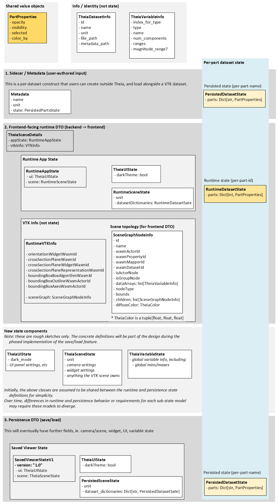

# ADR 14: VISOR Save and Load State
# =================================

## Status
Accepted

## Context
VISOR needs a way for a user to save the current viewer state to disk and restore it later, so they can
close the application and return to the same state when reopening it.  While basic Python APIs and method stubs
for saving and loading state exist currently, this functionality is not yet implemented.

The frontend owns the core visualization state, including UI, navigation controls, widgets, and per-dataset
visualization settings.  The backend manages data access and supporting services, but does not maintain a
complete view of the active visualization state on the client.

Backend-driven changes are sent to the frontend via an existing update mechanism.  It provides initial values for
some parts of the state (e.g. dataset per-part opacity), but does not include a complete representation of all
state that would need to be persisted and restored.

### Decision Summary (high level)
- Persisted format: JSON (versioned)
- Version field name (current code): `version` (e.g. `"1.0"`)
- Persisted keying:
  - datasets: by `dataset_name` (string)
  - parts: by `part_name` (string)
- Load behavior: best-effort apply; warn+skip mismatches; do not fail the load unless the file is invalid
- Dataset serialization: each dataset is serialized to the save directory in VTKHDF format as
  `<dataset_name>_snapshot.vtkhdf` when `save_state` is called

### Persisted Artifact Contract (v1)
- `save_state(path)` writes a directory containing:
  - `visor.json` — the persisted viewer state (JSON, versioned)
  - `<dataset_name>_snapshot.vtkhdf` — one VTKHDF file per registered dataset, serialized at save time
- `load_state(path)` reads `visor.json` from that directory and applies it.
- If the scene is empty at load time, `load_state` also loads each dataset from the corresponding
  `<dataset_name>_snapshot.vtkhdf` file in the save directory before applying state from `visor.json`.
- If the scene is not empty at load time (one or more datasets already registered), `load_state` skips dataset
  loading and applies only the viewer state from `visor.json`.
- The backend owns the persistence contract and validates the JSON; the frontend remains the runtime source-of-truth
  for visualization state.

This ADR is organized as follows:
* **Section 1 (Requirements and Constraints)** defines the scope, requirements, and
assumptions for this feature.
* **Section 2 (VISOR State Models)** clarifies the distinct viewer state representations
involved in this feature, their purpose, ownership, and lifecycle, and how they relate to each other.
* **Section 3 (Rough Proposed State Model)** presents a high-level diagram illustrating the proposed rough state model
structure, and how shared schema blocks are used across different state representations.
* **Section 4 (Client/Server State Synchronization)** describes how save/load interacts with the existing frontend
source-of-truth model and the request/response mechanisms used.
* **Section 5 (Full State Representation)** defines what we intend to capture in the persisted format and what is
phased/deferred.
* **Section 6 (Phased Implementation Plan)** proposes a staged
approach to implementing the feature in a way that manages risk and keeps each step focused.


***

## 1. Requirements and Constraints

### Requirements (functional)
1. Provide service + Python APIs to save and restore viewer state
   * save_state(path)
   * load_state(path)
2. The saved state should include anything necessary to restore the viewer to the same state, including at least:
   * UI state
     * dark mode
     * open / closed panels
   * VTK scene state:
      * unit
      * camera settings (camera location, point at/from, zooming factor)
      * widget states (e.g. enabled, clipping planes, box selection, etc)
   * dataset references and per-part settings:
     * opacity
     * visibility
     * selected
     * colored by (i.e. active variable)
   * variable states
     * variable min/max
3. The saved state should include a schema_version field so the format can evolve over time.
4. The load_state API supports loading the dataset inputs with the following behavior:
   * If the scene is empty, load_state loads each dataset from the corresponding `<dataset_name>_snapshot.vtkhdf`
     file in the save directory, then applies the viewer state from `visor.json`.
   * If the scene is not empty (one or more datasets already registered), load_state skips dataset loading and
     applies only the viewer state from `visor.json`.
5. The save_state API serializes all registered datasets and viewer state to a directory:
   * Each dataset is written as `<dataset_name>_snapshot.vtkhdf` in VTKHDF format.
   * The viewer state is written as `visor.json`.
   * This is true whether the datasets were originally loaded from disk or constructed from native Python objects.

   **Note:** An `is_dirty` flag is maintained per registered dataset as an implementation-level detail.
   The flag is set when a dataset is first registered or subsequently modified, and cleared on a successful
   `save_state` call.  This allows the implementation to identify datasets that have unsaved changes (i.e. have
   been modified or have never been saved).  It is a best-effort indicator: it reflects backend-side registrations
   and modifications only; changes made solely on the frontend do not affect it.

#### Definition: "scene is empty"
For the purposes of implementing (4), "scene is empty" means there are no datasets registered on the backend
(i.e., dataset registry count is zero).


### Non-functional requirements
1. Performance: load_state should apply state efficiently and avoid noticeable UI freezes during normal use.
2. Robustness: applying state should tolerate mismatches, applying matches and providing warnings for any mismatches.

### Out of scope
1. Autosave, crash recovery, or periodic snapshots.
2. Undo/redo support
3. Continuous frontend/backend synchronization (this is meant to be snapshot-based)
4. Exposing the persisted state as a user-editable or programmatically modifiable object outside the save_state/load_state APIs.
5. State file management or registry system (i.e. VISOR does not manage previously saved sessions by ID or otherwise).

### Assumptions
1. Stable identifiers across sessions are dataset names and part names
   * Discussion result 2026/01/09: Yes, use dataset names and part names as stable identifiers.  But note that we may have a future
use case for applying the same state to a different dataset with similar structure with similar part names,
but a different dataset name.  We can handle this case in the future when it comes up
2. It is the user's responsibility to:
   * Provide unique dataset names and unique part names (within a dataset).
   * If relying on load_state to load datasets from disk:
     * Call the load_state API from an empty scene.
     * Ensure the `<dataset_name>_snapshot.vtkhdf` files are present in the directory specified by `load_state`
       (these are written automatically by `save_state`).
   * If loading datasets manually:
     * Load the required datasets before calling load_state.
   * Ensure `visor.json` exists in the save directory and corresponds to the intended scene.
3. Mismatch handling:
   * If a dataset or part referenced in the saved state does not exist at load time, it is ignored with a warning.
   * Any state that can be applied is applied; entries that don't match are skipped.
4. Saves and loads are infrequent/ad hoc.

### Questions to confirm
1. **State file naming:** should the API accept a file path or a directory path?
   * Decision: both `save_state` and `load_state` accept a directory path.  `save_state` writes `visor.json`
     and one `<dataset_name>_snapshot.vtkhdf` per dataset into that directory.  `load_state` reads `visor.json`
     from the same directory, and reads dataset snapshots from there if the scene is empty.
2. **Backend-only mechanism:** Is it OK for save/load to be backend-driven only (no frontend button or autosave)?
   * Discussion result  2026/01/09: Yes.
3. **Load state error handling:** if load_state reads a valid file, but none of the entries apply (e.g. no matching datasets/parts), should that be treated as an error, or as a successful load with warnings?
4. Will we save and apply the full state, or just the parts that have been changed from defaults?
   * Discussion result  2026/01/09: Apply the full state.
5. **Does load_state reset the state to defaults** and then apply the saved state, or just apply the saved state
   on top of the current state?
   * Discussion result  2026/01/09: Apply on top of current state (additive).

***
## 2. VISOR State Models
This feature involves several distinct representations of viewer state that exist for different purposes
and at different points in the application lifecycle.  Some of these representations already exist in the codebase
in various forms, while others are clarified here.  Although they may contain similar per-part visualization
values, they differ in ownership, structure, mutability, and intended use.

This section focuses on per-part dataset state, as this is the area where similar data
appears in multiple places at the moment, and has been a source of confusion.

### Table 1: Per-part dataset state: what exists and why
The table below summarizes the different places where per-part dataset state currently exists in the backend
codebase, along with where each representation lives, what it is used for, and how it is keyed and structured.

| State Type | Where it lives                                                            | What it's for                                                                                        | Key | Shape                    |
|------------|---------------------------------------------------------------------------|------------------------------------------------------------------------------------------------------|-----|--------------------------|
| **Metadata defaults** | `Metadata.state: PersistedDatasetState`                                   | User-defined initial per-part visualization values provided as input (defaults applied at load time) | Per-part name (str) | Flat, single dataset     |
| **Runtime state** | `RuntimeDatasetState.partStates`                                          | Live per-part visualization state during an active viewing session                                   | Internal part_id (int) | Nested: dataset -> parts |
| **Persisted state** | `SavedViewerStateV1.scene.dataset_states[*].parts: PersistedDatasetState` | Snapshot of per-part state to save and restore a session later                                       | Per-part name (str) | Nested: dataset → parts  |

Although each of these representations stores per-part visualization values, they intentionally differ in keying, shape,
and purpose: defining initial defaults, supporting live interaction, and capturing a snapshot for save/load.

**Note:** For the initial implementation, the per-part schema used for metadata defaults (InitialPartsState) and
persisted state (PersistedViewerDatasetState) may be shared to reduce duplication, as both represent serialized per-part
visualization values keyed by part name.  Despite this shared schema, the two representations remain distinct
in purpose and lifecycle (defaults at load time vs snapshot for save/load).

### Table 2: Per-part dataset state: ownership and lifecycle
The table below summarizes the per-part dataset state representations, including where each representation lives, what
it is used for, and how it is keyed and structured.

| State Type                                                   | Created by / when                                                                      | Who is allowed to create/edit | Written to disk?                                  | Lifetime | Changes during session? |
|--------------------------------------------------------------|----------------------------------------------------------------------------------------|-------------------------------|---------------------------------------------------|----------|-------------------------|
| **Metadata defaults**                                        | User-authored ahead of time; loaded at dataset import                                  | User (in advance): treated as read-only at runtime | Yes (as input metadata, before any VISOR session) | Exists independently of sessions; loaded as input | No |
| **Frontend runtime per-part state (UI-owned)**               | Initialized from backend-provided defaults/load_state results                          | Frontend during live interaction | No                                                | Lives while dataset is loaded in VISOR session | Yes |
| **Backend runtime per-part state (RuntimePartsState.parts)** | Initialized during dataset/scene setup; refreshed from frontend snapshot when needed (e.g. save) | Backend (via backend operations & applying frontend snapshot) | No                                                | Lives while dataset is loaded in VISOR session | Yes |
| **Persisted state**                                          | Captured at save time and applied at load time                                         | Backend, only via the save/load mechanism | Yes (only via the save/load mechanism)            | Exists across sessions; in memory only during save/load | No |

### Why these representations remain distinct

These representations look similar in shape, but serve different purposes and cannot be unified without compromising
their individual requirements:

- **Metadata defaults** are user-authored, serialized, and treated as read-only at runtime.
They use part names for stability across imports.
- **Runtime state** is keyed by internal `part_id` for performance during live interaction and must support fast
lookups and updates.
- **Persisted state** is keyed by part name for stability across sessions and structured by dataset for readability
and partial loading.

Combining these into a single model would force one representation to satisfy conflicting constraints
(e.g., using part names for runtime lookups would hurt performance; using `part_id` in persisted state would break
across sessions when part IDs change). While the schema for per-part values may be shared where appropriate
(see note in Table 1), the state containers, ownership, and lifecycle remain distinct.

### Summary

Together, these representations form a coherent model in which similar schema blocks may be reused, but
state containers, ownership, and lifecycle remain distinct. This separation allows runtime interaction, persistence,
and external-facing defaults to coexist without introducing unintended APIs or tightly coupling
frontend and backend implementations.

The next section presents a rough proposed state model illustrating how these representations
relate to one another at a high level.

***
## 3. Rough Proposed State Model

The diagram below makes the runtime and persistence structure explicit by showing where per-part dataset state
is expected to exist and how it functions across the system: as user-authored metadata (initial defaults), as
frontend-facing runtime state, and persisted save/load state.

It also fills in the surrounding runtime state structure to show how these pieces relate to the overall viewer state,
and makes explicit which components may be shared between runtime and persistence, with the expectation that they may
diverge as requirements evolve.

Note that as this will also require schema changes to the runtime data transfer object (DTO) that is sent from the
backend to the frontend to initialize or update the viewer state.  There is a
[separate ADR](https://github.com/ansys-internal/theia/blob/doc/adr-scene-description-1/developer_docs/adrs/13-scene-details.md) to align on this schema.  (This ADR will be updated to reflect the final results of that discussion
once it is finalized.)




***
## 4. Client/Server State Synchronization

During normal client/server interaction in VISOR, the frontend is the source of truth for visualization state,
but the backend may trigger updates via `local_view.update()` in response to backend-driven operations
(e.g., dataset addition).  For most such operations driven by server API calls,
the `local_view.update()` trigger causes a full UI rebuild on the client, including state application.

For the save/load state feature, we expect the following behaviour:  at save time, the backend explicitly requests a
snapshot from the frontend to capture the authoritative current state. At load time, the backend reads the saved state
from disk and triggers a frontend update, which will overwrite existing values in the frontend's cached state.

As part of this feature, we implement the following mechanisms to support backend-driven state updates and requests:


* **Load State update mechanism (backend -> frontend state update)**

    * The backend triggers a `setState` call on the client, with the saved state as the payload.
      This is fire-and-forget from the server's perspective.
    * **Notes:** As the feature expands, we will need to expand the shared schema to fully represent the viewer state
    as required for save/load.

* **Save State request mechanism: backend request for frontend state snapshot**

    * The backend triggers a `getState` request to the client, which is a request for the
      frontend to send the current state back to the backend asynchronously.
    * The client, in turn, triggers a `save_state_response` function on the server which sends the response
      payload to the backend.


## 5. Full State Representation

At the time the save/load state feature was started, the state representation for save/load state was limited
to the per-part dataset state (opacity only).

For the runtime state at the client/server boundary, we maintain the schema definition in a
[separate ADR](https://github.com/ansys-internal/theia/blob/doc/adr-scene-description-1/developer_docs/adrs/13-scene-details.md).
This schema is intended to evolve as we expand the state representation to include all components required to
capture the viewer state for the save/load feature.

### 5a. Variable state
Currently, the frontend handles aggregating the global variables in a VISOR scene, which makes it the owner of the
min/max values for each variable, across the scene.
The backend is not currently aware of these global variable states, but they are needed to capture in the save/load
state to ensure a consistent restored state.
As such, we will need to add these variable states to the backend state representation and on-disk format as part of
this feature, and ensure they are included in the frontend snapshot and applied at load time.

**Note 1:** While the frontend currently manages the global variable aggregation across datasets for the scene, this is something
that would be more appropriate for the backend to manage and communicate to the frontend as part of the variable state.

This is something we can consider evolving in the future, but for the initial implementation,
we will keep the frontend as the owner of the variable state, and simply ensure it is included in the snapshot and
load application logic for save/load state.

**Note 2:** The active variable for each part is stored as a field of the per-part dataset state, which is discussed in
5b below.

**Note 3:** The variable state is required for the first phase of our implementation (as described in section 6 below).

### 5b. Full per-part dataset state
The per-part dataset state is currently limited to opacity only, but for a complete save/load state, we will need to
expand this to include all relevant per-part visualization values, including:
* visibility
* selected state
* variable colored by (i.e. active variable)
* variable component colored by (i.e. active variable component)

These values are owned by the client and currently exist in the frontend runtime state, but will need to be included in
the backend state representation and on-disk format for save/load state, and included in the frontend snapshot and
load application logic to ensure a consistent restored state.

### 5c. UI state
The details of the UI state representation are still to be defined, but will include window collapse/expand state, in
addition to any other state required to ensure a consistent restored state.

This is currently managed entirely on the frontend, but will need to be included in the save/load state representation
and application logic.

**Note:** Our first phase (see section 6 below) requires only the UI panel state to be defined and implemented.
The rest of the UI state will be deferred until the second phase, to keep the scope of the first phase
manageable and focused on establishing the core save/load mechanism end to end.

### 5d. Camera and view state
The details of the camera and view state representation are still to be defined, but includes the camera position,
point at/from, zoom level, focal point, etc.

This is currently managed entirely on the frontend, but will need to be included in the save/load state representation
and application logic to ensure a consistent restored state.

### 5d. Widget state
The widget state includes the enabled/disabled state of each widget, as well as any relevant settings for each widget
(e.g. clipping plane positions, box selection bounds, etc).
This is currently managed entirely on the frontend, but will need to be included in the save/load state representation
and application logic to ensure a consistent restored state.

All widget state is deferred until the second phase of implementation to keep the scope of the first phase manageable
and focused on establishing the core save/load mechanism end to end, with the more complex widget state deferred until
we have that core mechanism in place.

***
## 6. Proposed Implementation Plan

We propose implementing save/load state in two main phases.  The goal is to get a working end-to-end solution in place early,
with basic save/load capability, and then expand what is included in a second phase, to more completely capture
the viewer state.

The first phase will include all save/load state requirements _except_ the widget states and any UI state beyond
dark mode and open/closed panels.  The second phase will add widget states and any remaining UI state.

The backend is the entry point for save and load operations, but the frontend is the source of truth for the
visualization state.  The backend needs to explicitly request the current client state at save time.  The frontend
will need to ensure the frontend-cached state is correctly overwritten at load time.

**Summary:**
* Phase 1: End to end save/load state with limited scope, no dataset serialization/loading
* Phase 2: End to end save/load state with limited scope, with dataset serialization and loading
* Phase 3: Full save/load state with _complete viewer state_, with dataset serialization and loading

### Phase 1: End to end save/load state with limited scope, no dataset loading
The goal of this phase is to implement the core save/load mechanism end to end, with basic state captured and restored.
This phase is broken into two sub-phases to manage risk and keep each step focused.

#### Phase 1a: End-to-end opacity-only save/load with frontend hooks

The goal of this sub-phase is to implement the core save/load mechanism end to end, using only the per-part opacity state
as the captured/restored state.  This allows us to validate the overall mechanism, without needing to:
* Define the full state schema upfront.
* Implement complex state application logic in the frontend that does not yet exist there.

The steps involved are:
* Add backend APIs and HTTP endpoints for `save_state` and `load_state`.
* Define the on-disk state format and include basic versioning.
* Implement saving and loading of the per-part opacity state only.

This phase establishes the core contract between frontend and backend and ensures that load produces a
consistent restored state in the viewer.


#### Phase 1b: Expand scope of captured state to include camera settings and basic UI state

The goal of this sub-phase is to expand the set of state captured and restored to include:
* camera/view state (position, focal point, view up, zoom)
* basic UI state (dark mode, open/closed panels)
* variable state (active variable, min/max)
* per-part visibility, selected state, and colored by

This phase builds on the core mechanism established in Phase 1a, and expands the state schema
and the frontend application logic to handle the additional state.  Depending on the complexity involved, this
may be done in a single user story, or broken into multiple smaller stories, each focused on a specific state area
(e.g. camera, UI, variable, per-part visibility/selection).

Out of scope:
* widget states
* other UI state beyond dark mode and open/closed panels

**Result of Phase 1:**
At the end of Phase 1, we will have a working save/load state mechanism that captures and restores the core viewer state,
including camera, UI, variable, and per-part visibility/selection/colored by state.

Note that this only supports datasets that were loaded from disk originally.  `load_state` will not yet provide support
for loading datasets that were created in-memory at this time.


### Phase 2: End to end save/load state with limited scope, _with_ dataset serialization and loading
The goal of this phase is to enhance the `load_state` functionality to optionally load datasets from disk
if the current scene is empty. This allows users to restore the core elements of a session, including datasets,
when no datasets are currently loaded in VISOR.

**Result of Phase 2:**
The end result of Phase 2 is a save/load state mechanism that captures and restores the core relevant viewer state,
including loading datasets from disk if the scene is empty. This allows the user to save a session with datasets,
and restore it later without needing to manually load the datasets first.  (This means for the on-prem use
case, save state will serialize the datasets, and later restore without manually needing to load the datasets first.)

### Phase 3: Full save/load state with _complete viewer state_, with dataset serialization and loading

Expand saved state included in save/load state to improve completeness across the application.
The goal of this phase is to build on the core save/load mechanism established in Phase 1, and incrementally
expand the set of state that is captured and restored, to eventually achieve a functionally complete
save/load experience.

This includes:
* widget states (e.g. enabled, clipping planes, box selection, etc)
* any remaining UI state (e.g. panel visibility, collapsed/expanded state, other user-facing controls)

All of this state is captured via the frontend snapshot and re-applied during load as an explicit overwrite of the
frontend-cached values.

As additional state is brought into scope:
* the backend state representation and on-disk format are extended to include the new fields
* the state DTO exchanged between backend and frontend is extended accordingly

Depending on the complexity involved, we may treat this as a single user story, or break it into multiple smaller stories,
each focused on a specific widget or UI component.

**Result of Phase 3:**
The end result of Phase 3 is a complete save/load state mechanism that captures and restores all relevant viewer state,
making the saved and loaded sessions functionally and visually equivalent from the user's perspective.
Dataset serialization and loading (from Phase 2) remain in place; this phase completes the state coverage by
adding widget and any remaining UI state.

***

### Example persisted JSON shape (illustrative)
This is a minimal example of the intended persisted shape (not a complete schema):

```json
{
  "version": "1.0",
  "ui": { "darkTheme": false },
  "scene": {
    "unit": "m",
    "dataset_states": {
      "my_dataset": {
        "parts": {
          "part_a": { "opacity": 0.5 }
        }
      }
    }
  }
}
```
