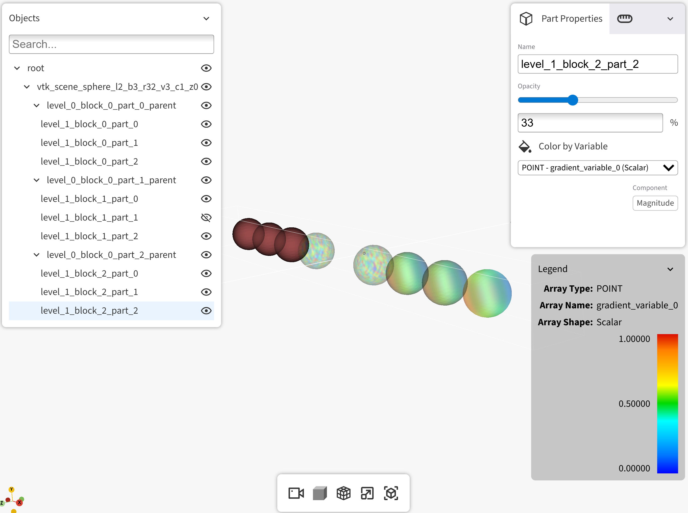
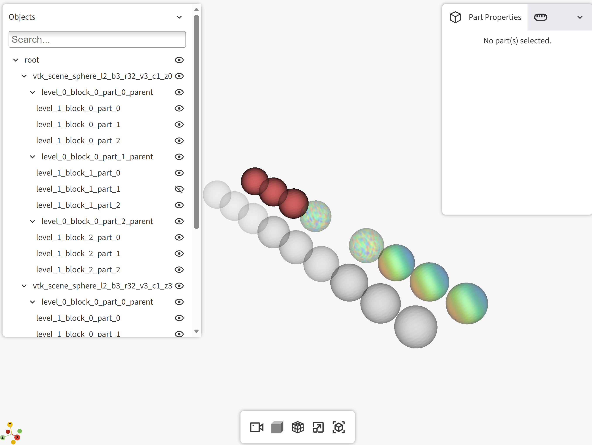
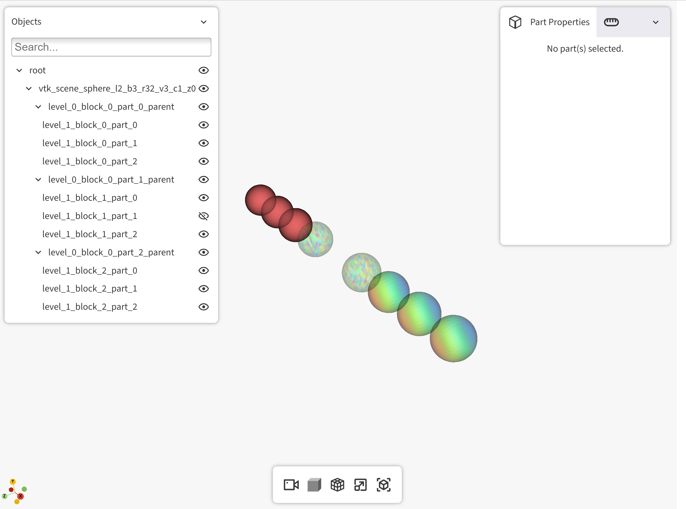
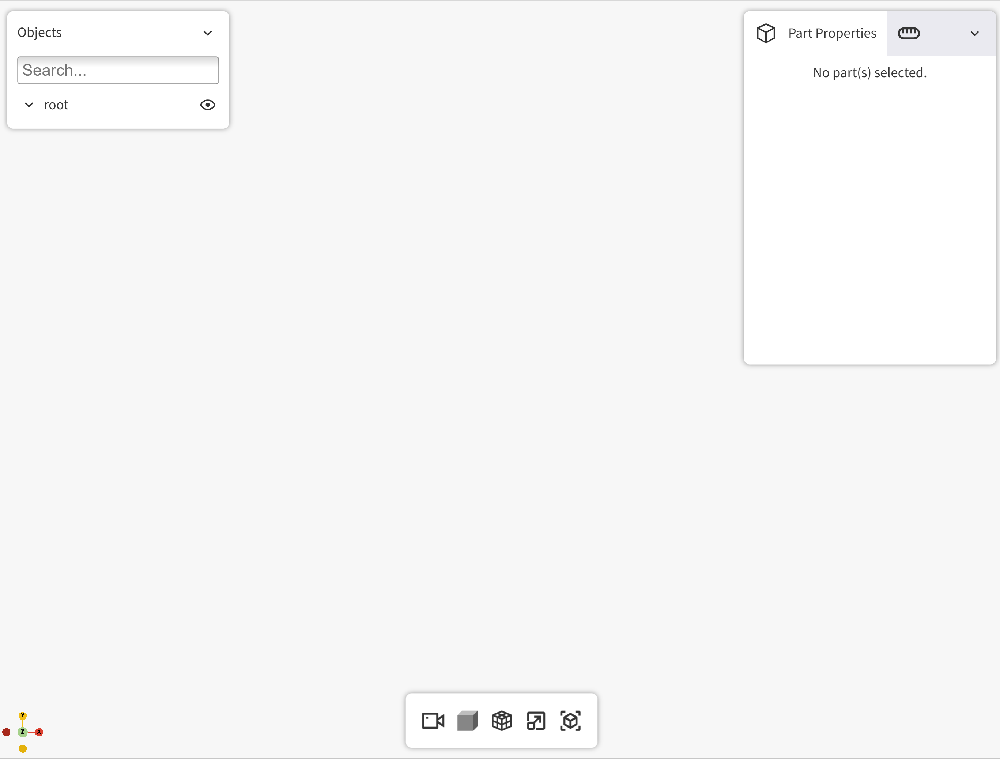

# Regression Testing Coverage for Visor

*April 2026*

---

## Overview

This document is a rough shared reference for the team, collecting representative tests that have been
useful when checking changes, so everyone has a common picture to work from and can contribute their own.

It is not a formal test plan or test strategy, and is not meant to be exhaustive or authoritative. The goal is
to write down what we already do, so the knowledge is shared rather than scattered, and so the tests outlined
here can provide info for our broader automated testing strategy.

Automated coverage for everything listed here is a work in progress, and this document also serves as a
running reference for what we want to grow towards as that coverage expands.

## A. Supported Environments, APIs, and Viewer Elements

### 1. Launch Environments

Visor has two main supported launch environments:

- **Service:** visor-cli
- **Native Python:** Jupyter notebook

### 2. Display Environments

There are three main supported test display environments:

- Raw browser
- Dash component
- Iframe within Jupyter notebook

### 3. APIs

We need to test all the public APIs using both the service and native Python.

1. `initialize` (`visor-cli init`)
2. `info`
3. `health`
4. `start`
5. `update`
6. `clear`
7. `add_dataset`
8. `remove_dataset`
9. `list_datasets`
10. `list_variables`
11. `update_variables`*
12. `save_state`
13. `load_state`
14. stop
15. stop_visualization
> \* `update_variables` is not exposed through visor-cli. It can be tested using the HTTP API directly, or via native Python.

### 4. Input Formats

The following APIs accept an input dataset, along with an optional metadata argument:

- `start`
- `update`
- `add_dataset`

There are several combinations of how we can pass the input dataset and optional metadata args, which is relevant for testing.

#### HTTP vs Native Python Inputs

The HTTP APIs accept a file path as the input dataset. The native Python APIs (i.e. the methods on the `Visor` class) accept either a file, or a VTK dataset object, as an input.

|  | **File** | **VtkDataSet object** | **File Metadata** | **Metadata object** |
|--|----------|-----------------------|-------------------|---------------------|
| **HTTP API** | Yes | No *(streaming not yet supported)* | Yes | Yes *(pass serialized as JSON, gets deserialized into `Metadata` class)* |
| **Native Python Methods** | Yes | Yes | Yes | Yes *(native Python `Metadata` object)* |

#### Required vs Optional Input Args

The `start` API does not require an input dataset, but the `update` and `add_dataset` APIs do. The `Metadata` class is optional for all.

| API | Input required? | Metadata required? |
|-----|-----------------|--------------------|
| `start` | No | No |
| `update` | Yes | No |
| `add_dataset` | Yes | No |

#### Input Dataset Formats

The following file formats and VTK dataset types are accepted:

| VTK Dataset Object | File extension when serialized | Composite? |
|--------------------|-------------------------------|------------|
| `vtkPolyData` | `.vtp`, `.vtkhdf` | No |
| `vtkUnstructuredGrid` | `.vtu`, `.vtkhdf` | No |
| `vtkMultiBlockDataSet` | `.vtm`, `.vtkhdf` | Yes |

> **Note:** `vtkMultiPieceDataSet` datasets loaded from a `.vtm` file are in scope for Visor but are not currently supported. In the future, we will also need to support `.vtkhdf` loading assemblies and partitions (which supersedes the older multi piece dataset), but this is not yet supported in Visor.

### 5. Viewer Elements

List of elements in the viewer that should be checked at each step:

- Tree view
- Top right window
- Legend
- Widgets at bottom

### 6. Viewer Interactions

List of actions to take in the viewer at each step to make sure all is working correctly:

- Select part in tree view
- Select part using picker
- Toggle visibility using tree view
- Adjust opacity via slider or text input in Properties panel
- Change diffuse color using color picker in Properties panel
- Color part by variable using Legend panel variable selector
- Select variable component (Magnitude, X, Y, Z, etc.) in Legend panel
- Adjust legend range min/max and apply
- Toggle perspective/orthographic projection (toolbar)
- Toggle cross-section plane (toolbar) and adjust plane interactively
- Toggle edges/wireframe display (toolbar)
- Toggle fullscreen (toolbar)
- Toggle bounding box display (toolbar)
- Orbit/pan/zoom camera
- Search/filter nodes in tree view
- Collapse/expand side panels
- etc.

---

## B. Regression Tests

Here we list a comprehensive set of tests to run to ensure the behaviour in Visor remains as expected for basic usage.

Run the following commands in a terminal window, using the `visor-cli` tool. Note that we need to run the comparable tests using a Jupyter notebook as well.

### 1. Test Files

The following files are used for testing below:

| Type             | Description                                        | Unique part names? | File name                                                 | Metadata file |
|------------------|----------------------------------------------------|--------------------|-----------------------------------------------------------|---------------|
| MultiBlock       | Multiblock of 6 spheres                            | Yes                | `examples\assets\vtk_scene_sphere_l2_b3_r32_v3_c1_z0.vtm` | `examples\assets\vtk_scene_sphere_l2_b3_r32_v3_c1_z0.json` |
| Multiblock       | Multiblock of 6 spheres, translated in z direction | Yes                | `examples\assets\vtk_scene_sphere_l2_b3_r32_v3_c1_z3.vtm` | `examples\assets\vtk_scene_sphere_l2_b3_r32_v3_c1_z3.json` |
| Multiblock       | Cylinder multiblock                                | No                 | `tests/files/many_blocks/many_blocks.vtm`                 | |
| PolyData         | Rectangular plate                                  | -                  | `tests/files/plate.vtp`                                   | |
| UnstructuredGrid | Triangular prism                                   | -                  | `tests/files/mesh.vtu`                                    | |


### 2. HTTP API Tests

The HTTP APIs can be tested in two main ways:

1. **visor-cli command line tool:** A helper tool that can run the Visor service and interact with it by submitting requests. The primary limitation is that the `update_variables` API is not currently exposed via the CLI tool, so it needs to be tested directly with an HTTP request.
2. **HTTP requests:** Any of the APIs can be tested directly with HTTP requests (e.g. using the Python `requests` library). Currently the only API that needs to be tested via a direct HTTP request (vs the CLI tool) is the `update_variables` API.


#### A. Visor CLI Tool

Before running the following commands, run:

```bash
visor-cli server start
```


##### Step 1. Start a Visor session with a multiblock file + metadata file

```bash
visor-cli instance start examples\assets\vtk_scene_sphere_l2_b3_r32_v3_c1_z0.vtm --metadata-path examples\assets\vtk_scene_sphere_l2_b3_r32_v3_c1_z0.json
```

**Check that:**
- The dataset loads correctly: meshes look as expected, the opacities are correct in the slider, and opacities are applied correctly on the mesh.


##### Step 2. Print info about the service's active instance

```bash
visor-cli instance info
```

**Check that** the API runs and the output is correct:

```json
{'app_name': 'Visor Viewer', 'host': 'localhost', 'port': 8081, 'standalone': True, 'datasets': ['vtk_scene_sphere_l2_b3_r32_v3_c1_z0']}
```


##### Step 3. Adjust settings on parts

Adjust settings on the following parts:

- **`level_0_block_0_part_0_parent`:**
  - Adjust opacity to something high but not 100%, e.g. 95%
  - Color by constant (i.e. don't change the dropdown color by variable value)
  - Change the Constant Color to something different

- **`level_0_block_0_part_1_parent`:**
  - Color by POINT -`random_variable_2` (Scalar)

- **`level_0_block_0_part_2_parent`:**
  - Color by POINT - `gradient_variable_0` (Scalar)

- **`level_1_block_1_part_1`** (or any individual sphere):
  - Toggle visibility **OFF**

**Check that** all settings are applied correctly.



##### Step 4. Add a new dataset to the scene

```bash
visor-cli instance add examples\assets\vtk_scene_sphere_l2_b3_r32_v3_c1_z3.vtm --metadata-path examples\assets\vtk_scene_sphere_l2_b3_r32_v3_c1_z3.json
```

**Check that:**
- The new dataset loads correctly: meshes look as expected, the opacities are correct in the slider, and opacities are applied correctly on the mesh.
- The first dataset is still present, with part properties preserved from before the `add_dataset` operation.



##### Step 5. List datasets

```bash
visor-cli instance list
```

**Confirm** the output shows correct information about both datasets:

```json
{
    "6857852647438280": {
        "id": 6857852647438280,
        "name": "vtk_scene_sphere_l2_b3_r32_v3_c1_z0",
        "unit": "m",
        "file_path": "examples\\assets\\vtk_scene_sphere_l2_b3_r32_v3_c1_z0.vtm",
        "metadata_path": "examples\\assets\\vtk_scene_sphere_l2_b3_r32_v3_c1_z0.json"
    },
    "3610179548300432": {
        "id": 3610179548300432,
        "name": "vtk_scene_sphere_l2_b3_r32_v3_c1_z3",
        "unit": "m",
        "file_path": "examples\\assets\\vtk_scene_sphere_l2_b3_r32_v3_c1_z3.vtm",
        "metadata_path": "examples\\assets\\vtk_scene_sphere_l2_b3_r32_v3_c1_z3.json"
    }
}
```


##### Step 6. Remove the second dataset

```bash
visor-cli instance remove 3610179548300432
```

**Check that** the dataset was removed in the viewer, and that the other dataset still has the expected per-part settings applied.



##### Step 7. Save the state

```bash
visor-cli instance save saved_state
```

**Confirm** the state was saved to the specified directory:

```
(.venv) ?? ls saved_state
visor.json  vtk_scene_sphere_l2_b3_r32_v3_c1_z0_snapshot.vtkhdf
```


##### Step 8. Test `load_state` on already-loaded asset

Refresh the browser and load the state:

```bash
visor-cli instance load saved_state
```

**Check that** the state is reapplied correctly on the dataset.


##### Step 9. Test `load_state` on empty scene

Remove the dataset from the scene:

```bash
visor-cli instance list  # get the dataset ID if needed
```

```json
{
    "6857852647438280": {
        "id": 6857852647438280,
        "name": "vtk_scene_sphere_l2_b3_r32_v3_c1_z0",
        "unit": "m",
        "file_path": "examples\\assets\\vtk_scene_sphere_l2_b3_r32_v3_c1_z0.vtm",
        "metadata_path": "examples\\assets\\vtk_scene_sphere_l2_b3_r32_v3_c1_z0.json"
    }
}
```

```bash
visor-cli instance remove 6857852647438280
```



**Confirm** there is an empty scene, then load the saved state:

```bash
visor-cli instance load saved_state
```

**Check that** the dataset was loaded and the saved state was applied.


##### Step 10. Further Tests of Save/Load State

There are many elements to the save/load state feature. Ideally we will have a separate section dedicated to this feature.

> **TODO:** *Create separate list for save/load state regression tests, covering all supported save/load state elements*
##### Step 11. Stop visualization

```bash
visor-cli instance stop_visualization
```

##### Step 12. Stop and remove the instance

```bash
visor-cli instance stop
```
#### B. HTTP Requests

The `visor-cli` tool currently wraps all APIs except one (`update_variables`). If there is a need to test all the APIs directly using HTTP requests, the steps in the previous section should be replicated using direct HTTP requests.

To test `update_variables` using a HTTP request, a Jupyter notebook is included in the Visor repository to demonstrate how to test via a HTTP request:

```
examples/notebooks/Variable Update Testing ??? Plate Example HTTP API.ipynb
```


### 3. Native Python Tests

The tests outlined in the HTTP API section above also need to be tested via the native Python class directly.

These can be tested either in a Python script or in a Jupyter notebook.  Jupyter notebooks are a primary supported
environment for Visor, but for automated testing, it can be difficult to set up and maintain a long list of tests in a
Jupyter notebook.

We expect to have our primary regression tests for the native Python class in Python scripts that can be run
automatically as part of a CI pipeline, with a few targeted tests automated in a Jupyter notebook.  (We do already have
one such test in our Visor tests.)

#### A: Specific examples available in Jupyter notebooks

For convenience, the native Python equivalents of the Visor CLI examples above are illustrated in the following notebook.
(Note that this is to illustrate the usage in native Python, not suggesting these need to be automated in a notebook.)

```
tests/docs/VisorPythonClassExamples.ipynb
```

To test `update_variables` using the native Python class specifically (which has a slightly more involved setup),
a Jupyter notebook can be referenced, included in the 'examples' directory of the Visor repository:

```
examples/notebooks/Variable Update Testing ??? Plate Example.ipynb
```

#### B: Additional tests for native Python Visor class
In addition to the tests outlined above, we may also want to consider the following:
2. Basic start/stop usage with a VTK object instead of a file path
2. Argument check for the `Visor` class methods
3. Mirror API checks:
   * update
   * add_dataset
   * remove_datsaet
   * clear (only Python Native)
   * list_variables
   * update_variables
   * save_state/load_state
4. Async start (`examples/asynchronous_start.py` for reference)


### 4. Dash Component Features

The Dash component has specific behaviours that need testing independently of the rest of Visor:

1. Parts snapshot
2. Aspect ratio and pixel density
3. Dark mode

TODO: Add any additional details for Dash-specific features that need to be checked on changes.
